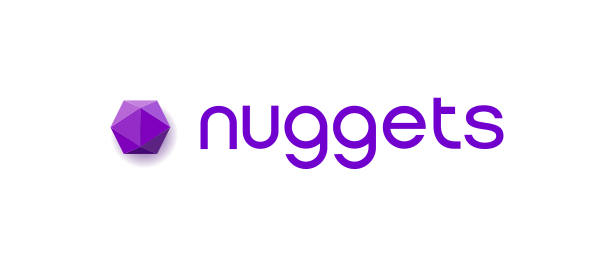

<p align="center">
  <a href="https://nuggets.life"></a>
</p>

# langchain-nuggets

[](https://github.com/NuggetsLtd/langchain-nuggets/actions/workflows/ci.yml)
[](https://github.com/NuggetsLtd/langchain-nuggets/actions/workflows/codeql.yml)
[](https://pypi.org/project/langchain-nuggets/)
[](https://www.npmjs.com/package/@nuggetslife/langchain-nuggets)
[](./LICENSE)

Authority middleware for LangChain / LangGraph — pre-execution trust enforcement on every tool call.

Wrap any tool node and the middleware calls the Nuggets authority endpoint before each tool executes. The backend evaluates a scoped delegation, returns an `ALLOW` or `DENY` decision, and signs an audit proof. Tools that aren't allowed never run. Available for **Python** and **TypeScript**.

## Why Nuggets Authority?

Most agent middleware shapes *prompts* or guardrails *outputs*. Nuggets Authority governs *actions* — it answers "is this agent allowed to do **this**, right now, on whose authority?" before a tool ever runs, and leaves cryptographic proof that it did.

- **Pre-execution enforcement, not after-the-fact logging.** Every tool call is checked against a scoped delegation *before* it executes. Unauthorized calls never run — the middleware fails closed.
- **Cryptographic accountability.** Each decision is a signed, independently verifiable proof artifact — who acted, what they did, when, and under which authority. Proof verification is on by default and tamper-evident.
- **Authority you can scope and revoke.** Delegations are bound by capability, target, invocation cap, and expiry — issued and revoked in the Nuggets portal, enforced live by the backend.
- **Intent binding.** Attach an intent resolver and proofs carry an `intent_hash`, so the same tool call and parameters can produce distinct evidence when the business intent changes.
- **Identity you can trust.** Every request is signed by the agent's key (RS256) and bound to its decentralized identifier (DID); the backend verifies ownership before deciding.
- **Drop-in for LangChain & LangGraph.** Works with both the tool-node and agent middleware APIs in a few lines — no changes to your tools.
- **Run it your way.** Hosted Nuggets, or self-hosted against your own deployment with a private CA.

Built on [Nuggets](https://nuggets.life), the universal trust infrastructure for autonomous AI. Nuggets governs at the point of execution.

### Beyond identity and policy

Enterprise identity (SSO) proves *who* an agent is. Operational policy and guardrail layers constrain *what* it may do and emit logs. Neither answers the question that matters for accountable agent actions: **who authorised this agent to take this specific action — and can anyone prove it afterwards?**

| Question | Identity / SSO | Policy / guardrails | Nuggets Authority |
|----------|:-:|:-:|:-:|
| Who is the user / agent? | ✅ | — | ✅ |
| What may the agent access? | — | ✅ | ✅ |
| **Who authorised this action?** | — | — | ✅ |
| **Was it within the delegated scope?** | — | — | ✅ |
| **What intent was attached?** | — | — | ✅ |
| Evidence it produces | — | internal logs | cryptographic proof |
| Independently verifiable? | — | — | ✅ |
| Reveals only hashes, not raw data? | — | — | ✅ |

A Nuggets delegation already carries the agent's verified identity (its DID) and exactly what it may do (allowed capabilities and targets) — so it covers the *who* and *what* on its own, and adds the layer the others can't: **who delegated this authority, whether the action is within scope, and a tamper-evident proof of the decision**, enforced fail-closed before the tool runs. It **integrates with your existing SSO** rather than forcing a rip-and-replace. Proofs are signed and verifiable by any party against the authority's published keys — no callback to a Nuggets service required — and reference hashes of parameters and results, never the raw data.

## Packages

Two SDKs at feature parity, each with its own quickstart, configuration, and examples:

### Python — [`langchain-nuggets`](./packages/python)

[](https://pypi.org/project/langchain-nuggets/)
[](https://pypi.org/project/langchain-nuggets/)

```bash
pip install langchain-nuggets
```

LangChain / LangGraph `ToolNode` and `create_agent`. Full usage → **[Python package README](./packages/python/README.md)**.

### TypeScript — [`@nuggetslife/langchain-nuggets`](./packages/js)

[](https://www.npmjs.com/package/@nuggetslife/langchain-nuggets)
[](https://www.npmjs.com/package/@nuggetslife/langchain-nuggets)

```bash
npm install @nuggetslife/langchain-nuggets
```

LangChain.js / LangGraph.js `ToolNode` and `createAgent`. Full usage → **[TypeScript package README](./packages/js/README.md)**.

## Provisioning

Both SDKs need a Nuggets agent identity, its private key, and a delegation. To provision them in the portal, see the [agent provisioning runbook](./docs/agent-provisioning.md).

## Contributing

This project is maintained by the Nuggets team. Issues and pull requests are welcome — see [CONTRIBUTING.md](./CONTRIBUTING.md) for branch/PR conventions, local setup, and the live smoke tests, and [SECURITY.md](./SECURITY.md) to report a vulnerability (please don't open public issues for security).

## About Nuggets

Nuggets is the universal trust infrastructure for autonomous AI. Nuggets governs at the point of execution. Learn more at [nuggets.life](https://nuggets.life).

## License

[MIT](./LICENSE)

## Trademarks

`langchain-nuggets` is an independent, community-maintained integration and is not affiliated with, sponsored by, or endorsed by LangChain, Inc. "LangChain" and "LangGraph" are trademarks of LangChain, Inc. All other trademarks are the property of their respective owners.
